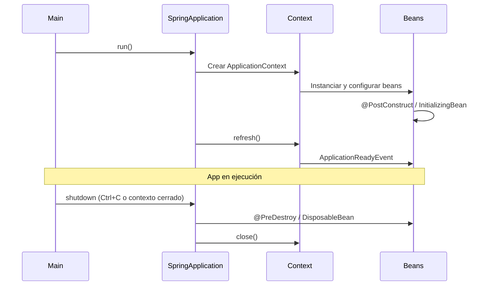

# Ciclo de vida APP JAVA con Spring Boot

Una aplicación Spring Boot sigue un ciclo de vida claro: arranque del contexto, creación y configuración de beans, ejecución de la lógica de negocio y cierre ordenado. Conocer las fases ayuda a colocar inicialización, configuración y limpieza en el lugar correcto.

## Fases del ciclo de vida



---

## 1. Arranque

Al ejecutar `SpringApplication.run(...)`:

1. Se crea el **ApplicationContext** (contenedor de IoC).
2. Se escanean componentes (`@Component`, `@Service`, `@Repository`, etc.) y se registran definiciones de beans.
3. Se instancian los beans (por defecto singleton en el ámbito de aplicación).
4. Se inyectan dependencias (constructor, campo o setter).
5. Se llama a **inicialización** de beans: `@PostConstruct`, `InitializingBean.afterPropertiesSet()`, o métodos con `@Bean(initMethod = "...").
6. El contexto hace **refresh**: termina de inicializar y publica eventos (por ejemplo `ContextRefreshedEvent`).
7. Si hay un servidor embebido (Tomcat), se inicia y la aplicación queda **lista** (`ApplicationReadyEvent`).

---

## 2. Ejecución

La aplicación está en marcha: se atienden peticiones HTTP, se procesan mensajes o se ejecuta el código que hayas definido en tu `main` o en runners (`CommandLineRunner`, `ApplicationRunner`). Los beans viven en el contexto y se reutilizan según su ámbito (scope).

---

## 3. Cierre (shutdown)

Al cerrar el contexto (Ctrl+C, `context.close()`, o shutdown del servidor):

1. Se dejan de aceptar nuevas peticiones.
2. Se invocan métodos de **destrucción**: `@PreDestroy`, `DisposableBean.destroy()`, o `@Bean(destroyMethod = "...")`.
3. Se cierra el contexto y se liberan recursos (conexiones, threads del pool, etc.).

**Ejemplo (código):** Inicialización y cierre con anotaciones estándar:

```java
@Component
public class MiServicio {
    @PostConstruct
    public void init() {
        // Se ejecuta tras inyección de dependencias
    }

    @PreDestroy
    public void cleanup() {
        // Se ejecuta al cerrar el contexto
    }
}
```

---

## Eventos útiles

| Evento                               | Momento                                       |
| ------------------------------------ | --------------------------------------------- |
| `ApplicationContextInitializedEvent` | Contexto creado, antes de cargar beans        |
| `ContextRefreshedEvent`              | Contexto refrescado, beans listos             |
| `ApplicationReadyEvent`              | Aplicación totalmente arrancada (servidor up) |
| `ContextClosedEvent`                 | Contexto en proceso de cierre                 |

Puedes escuchar estos eventos con `@EventListener` o implementando `ApplicationListener` para ejecutar lógica en una fase concreta del ciclo de vida.

---

[← Volver al README principal](../../README.md)
