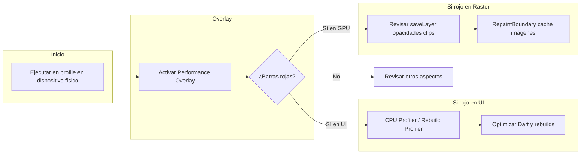

# Flutter: herramientas para medir rendimiento

Flutter apunta a 60 fps (≈16 ms por frame) o 120 fps en dispositivos capaces. Cuando un frame tarda mucho más en generarse se pierde y la animación se ve entrecortada (**jank**). Para medir y diagnosticar rendimiento hace falta ejecutar en **modo profile** y, salvo excepciones, en **dispositivo físico**; los modos de compilación se detallan en [Flutter: compilación y despliegue](../flutter-compilacion-despliegue/README.md).

## Modo profile (prerrequisito)

Las métricas en debug o en emulador/simulador no son representativas de release. Siempre perfilar en profile:

| Entorno        | Cómo activar profile                                                       |
| -------------- | -------------------------------------------------------------------------- |
| Terminal       | `flutter run --profile`                                                    |
| VS Code        | En `launch.json`: `"flutterMode": "profile"` en la configuración de launch |
| Android Studio | Run > Flutter Run main.dart in Profile Mode                                |

Tras lanzar la app, abrir DevTools desde la URL que muestra la consola o con `flutter pub global run devtools`.

## Performance Overlay

Overlay dibujado por el motor (no por el framework), con impacto mínimo en el rendimiento.

**Qué muestra:** dos gráficos de series temporales (últimas ~300 frames):

- **Gráfico inferior (UI):** tiempo por frame en el hilo donde corre el Dart (isolate principal). Incluye tu código y el trabajo del framework (build, layout, etc.).
- **Gráfico superior (GPU/Raster):** tiempo por frame en el hilo de rasterización (Skia/Impeller), que convierte el árbol de capas en píxeles.

**Interpretación:** Líneas blancas horizontales cada 16 ms. Barras verdes = frame dentro del presupuesto; barras rojas = frame que se pasó (jank). Si ambos gráficos muestran rojo, priorizar el diagnóstico en el hilo UI.

**Cómo activarlo:**

| Método   | Acción                                                                                 |
| -------- | -------------------------------------------------------------------------------------- |
| DevTools | Performance view > botón "Performance Overlay"                                         |
| Consola  | Tecla **P** con la app en ejecución                                                    |
| Código   | `MaterialApp(showPerformanceOverlay: true)` o widget `PerformanceOverlay.allEnabled()` |

Referencia: [Add performance overlay](https://docs.flutter.dev/testing/code-debugging#add-performance-overlay).

## Flutter / Dart DevTools

Abrir con `flutter pub global run devtools` o desde el enlace que muestra la consola al ejecutar la app (o desde el IDE).

### Performance view (Timeline)

- Gráfico de frames Flutter con colores por hilo: UI (p. ej. morado), Raster (verde), Async (amarillo).
- Análisis por frame: duración de eventos, stack traces; ampliar frames para ver secuencias y localizar trabajo costoso en build vs raster.

### CPU profiler

- **Modos:** _Sampling_ (bajo overhead, muestreo periódico del call stack) e _Instrumentation_ (trazado detallado, mayor overhead).
- **Vistas:** call tree (top-down), bottom-up, method table, flame chart.
- **Arranque:** usar `--profile-startup` con `dart run` o `flutter run` para no sobrescribir el buffer de muestras al iniciar.

### Memory view

- Snapshots del heap; comparar entre snapshots para ver crecimiento y posibles fugas.
- Seguimiento de asignaciones en tiempo real; análisis de rutas de retención.

### Network view

- Tráfico HTTP/HTTPS y WebSocket (p. ej. `dart:io` HttpClient, dio, paquetes compatibles).
- Grabación automática al abrir la pestaña; filtros por tipo, estado, método, URI. Para capturar tráfico desde el arranque: `flutter run --start-paused` o `dart run --pause-isolates-on-start`.

## Widget Rebuild Profiler (IDE)

En IntelliJ y Android Studio: muestra conteo de reconstrucciones por widget/pantalla y por frame. Sirve para detectar rebuilds innecesarios que provocan jank. Ver [Show performance data](https://docs.flutter.dev/tools/android-studio#show-performance-data).

## Tracing en código (dart:developer)

El paquete `dart:developer` permite marcar zonas personalizadas (Timeline, etc.) y verlas en la Timeline de DevTools. Útil para acotar el coste de un método o flujo. Ver [Tracing Dart code](https://docs.flutter.dev/testing/code-debugging#trace-dart-code-performance).

## Benchmarks con tests de integración

Con Flutter Driver y tests de integración se pueden obtener métricas repetibles: jank, tiempo de arranque, tamaño de descarga, eficiencia de batería. Ver [Measure performance with an integration test](https://docs.flutter.dev/cookbook/testing/integration/profiling) e [Integration testing](https://docs.flutter.dev/testing/integration-tests).

## Métricas clave (resumen)

| Métrica / API               | Qué mide                                                                                              |
| --------------------------- | ----------------------------------------------------------------------------------------------------- |
| **FrameTiming** (`dart:ui`) | `buildDuration`, `rasterDuration`, `totalSpan` por frame                                              |
| Estadísticas de frames      | Promedio, P90, P99 y peor caso para build y raster (p. ej. en dashboard)                              |
| Primer frame                | Tiempo hasta el primer frame rasterizado (`firstFrameRasterized`)                                     |
| CPU/GPU                     | Uso aproximado (energía) vía trazas; ver [Performance metrics](https://docs.flutter.dev/perf/metrics) |
| Tamaño de app               | `release_size_bytes`; ver [App size](https://docs.flutter.dev/perf/app-size)                          |

## Flujo de diagnóstico recomendado

Buenas prácticas: usar siempre dispositivo real y modo profile; si hay jank en ambos hilos, empezar por el hilo UI (Dart). En el hilo Raster, revisar uso de `saveLayer`, opacidades que fuerzan capas offscreen, clips costosos y si conviene `RepaintBoundary` o caché de imágenes.

## Referencias

- [DevTools](https://docs.flutter.dev/tools/devtools)
- [Performance view](https://docs.flutter.dev/tools/devtools/performance)
- [Flutter performance profiling (UI)](https://docs.flutter.dev/perf/ui-performance)
- [Performance metrics](https://docs.flutter.dev/perf/metrics)

---

[← Volver al README principal](../../README.md)
