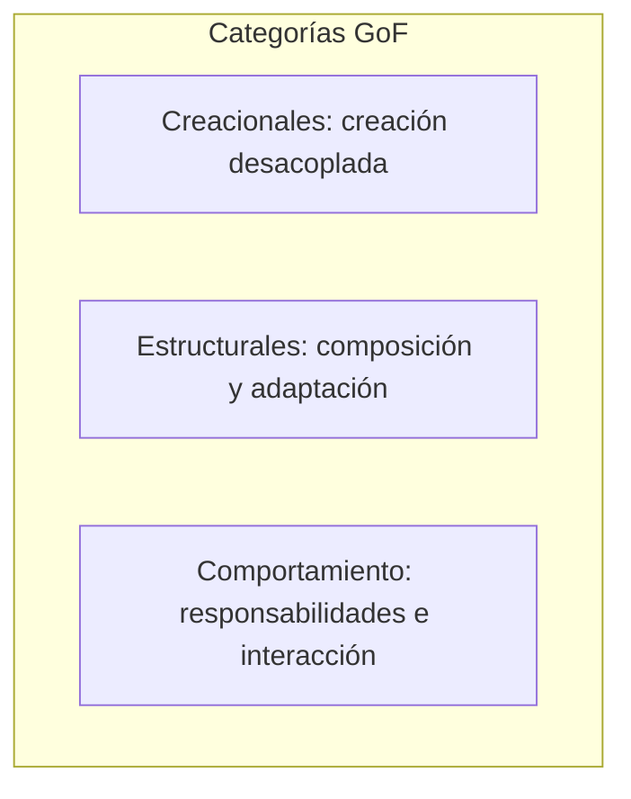

# GoF: Gang of Four y patrones de diseño

El libro _Design Patterns: Elements of Reusable Object-Oriented Software_ (Gamma, Helm, Johnson, Vlissides — 1994) se conoce como **Gang of Four (GoF)** y recopila 23 patrones de diseño clásicos en tres categorías: creacionales, estructurales y de comportamiento. Son la base de muchos de los patrones que se usan hoy en día.

## Relación con los patrones de diseño

En este repositorio el tema [Patrones de Diseño](../patrones-diseno/README.md) desarrolla patrones con ejemplos y código. El **GoF** es el catálogo original que los nombra y los agrupa; los patrones que allí aparecen (Singleton, Factory, Observer, Strategy, etc.) son los del libro.

## Las tres categorías GoF

| Categoría          | Propósito                                     | Algunos patrones                                                |
| ------------------ | --------------------------------------------- | --------------------------------------------------------------- |
| **Creacionales**   | Creación de objetos desacoplada y flexible    | Singleton, Factory Method, Abstract Factory, Builder, Prototype |
| **Estructurales**  | Composición de clases y objetos               | Adapter, Decorator, Facade, Proxy, Composite, Bridge            |
| **Comportamiento** | Interacción y responsabilidades entre objetos | Observer, Strategy, Command, Template Method, State, Iterator   |

## Qué es un patrón según el GoF

En el libro, un **patrón de diseño** es una solución recurrente a un problema de diseño en un contexto dado, documentada con **nombre**, **problema**, **solución** y **consecuencias**. No es solo una receta de código: el valor está en entender cuándo aplicarlo y qué trade-offs implica.

Cada patrón en el catálogo sigue una estructura típica de ficha:

| Sección                   | Contenido                                                            |
| ------------------------- | -------------------------------------------------------------------- |
| **Intent**                | Objetivo del patrón en una frase                                     |
| **Motivación**            | Situación problema que justifica el patrón                           |
| **Aplicabilidad**         | Cuándo usar el patrón (condiciones)                                  |
| **Estructura**            | Diagrama de clases/objetos (participantes y relaciones)              |
| **Participantes**         | Roles (clases/objetos) y sus responsabilidades                       |
| **Colaboraciones**        | Cómo interactúan los participantes                                   |
| **Consecuencias**         | Ventajas, desventajas y efectos en flexibilidad, reutilización, etc. |
| **Implementación**        | Detalles prácticos, trampas y variantes                              |
| **Ejemplos conocidos**    | Uso en sistemas reales (Smalltalk, C++, etc.)                        |
| **Patrones relacionados** | Otros patrones que complementan o se usan junto a este               |

Conocer esta estructura ayuda a leer el libro y a documentar o elegir patrones con criterio: no solo “qué código escribir”, sino “qué problema resuelvo y qué consecuencias asumo”.

## Cuándo pensar en cada categoría

- **Creacionales**: cuando la **creación de objetos** es compleja, cuando quieres **desacoplar** el código de implementaciones concretas, cuando necesitas **controlar el ciclo de vida** o el **número de instancias** (por ejemplo una única instancia, o familias de objetos coherentes). Pensar en esta categoría cuando `new` o la construcción directa acopla demasiado o no escala.

- **Estructurales**: cuando el foco está en **componer** clases y objetos (parte-todo, wrappers, adaptadores), en **adaptar interfaces** incompatibles, en **simplificar** un subsistema con una fachada o en **controlar el acceso** o la representación de un objeto (proxy, lazy loading). Relacionados con la idea de “composición sobre herencia” para estructuras flexibles.

- **Comportamiento**: cuando la preocupación es **asignar responsabilidades** entre objetos, el **flujo de datos o notificaciones** (uno-a-muchos, encadenamiento), **algoritmos intercambiables** (estrategias) o **secuencias de pasos** con pasos variables (template method). Pensar en esta categoría cuando el comportamiento depende de muchos estados o de la colaboración entre varios objetos.

## Relaciones entre patrones del catálogo

En el libro, los patrones no están aislados: se referencian entre sí. Algunas relaciones típicas:

| Patrón A         | Relación    | Patrón B             | Nota breve                                                                        |
| ---------------- | ----------- | -------------------- | --------------------------------------------------------------------------------- |
| Abstract Factory | suele usar  | Factory Method       | Las fábricas concretas crean productos vía factory method.                        |
| Composite        | suele usar  | Iterator             | Recorrer los hijos de un composite sin exponer la estructura interna.             |
| Decorator        | similar a   | Proxy                | Ambos envuelven un objeto; Decorator añade comportamiento, Proxy controla acceso. |
| State            | similar a   | Strategy             | Estado cambia comportamiento “desde dentro”; Strategy se inyecta “desde fuera”.   |
| Builder          | complementa | Abstract Factory     | Builder construye paso a paso; Abstract Factory devuelve familias completas.      |
| Facade           | puede usar  | varios estructurales | La fachada simplifica un subsistema que internamente puede usar Adapter, etc.     |

Conocer estas relaciones ayuda a combinar patrones y a no duplicar responsabilidades.

## Por qué siguen siendo relevantes

- Dan **nombres comunes** a soluciones recurrentes (Observer, Strategy, etc.), lo que facilita la comunicación.
- Describen el **problema**, la **solución** y las **consecuencias**, no solo el código.
- Son independientes del lenguaje; se adaptan a Java, C#, TypeScript, Go, etc.
- Muchos frameworks y librerías los usan (eventos → Observer, plugins → Strategy, middleware → Decorator/Chain).
- Aplicarlos con criterio —solo cuando el problema encaja— evita sobreingeniería y mantiene el valor del vocabulario común.

## Consecuencias y uso responsable

No conviene aplicar patrones por moda. Primero debe haber un **problema claro** (creación rígida, interfaces incompatibles, comportamiento que varía con el estado, etc.); después se revisa si algún patrón del catálogo encaja.

Consecuencias típicas de usar patrones GoF:

- **Más clases e interfaces**: mayor indirección y más archivos; en contextos muy simples puede ser sobreingeniería.
- **Flexibilidad y reutilización**: bien aplicados, desacoplan y facilitan cambios y pruebas.
- **Documentación implícita**: quien conoce el catálogo entiende la intención al ver nombres como Observer o Strategy.

El libro documenta para cada patrón sus consecuencias concretas (positivas y negativas); conviene revisarlas antes de adoptar uno.

## Dónde ver ejemplos y código

Para cada patrón con tablas resumidas, ejemplos de vida real y código (TypeScript), consulta el tema [Patrones de Diseño](../patrones-diseno/README.md).

**Referencia al libro:** Gamma, E.; Helm, R.; Johnson, R.; Vlissides, J. _Design Patterns: Elements of Reusable Object-Oriented Software_. Addison-Wesley, 1994. Existen reimpresiones y traducciones.

---

[← Volver al README principal](../../README.md)
